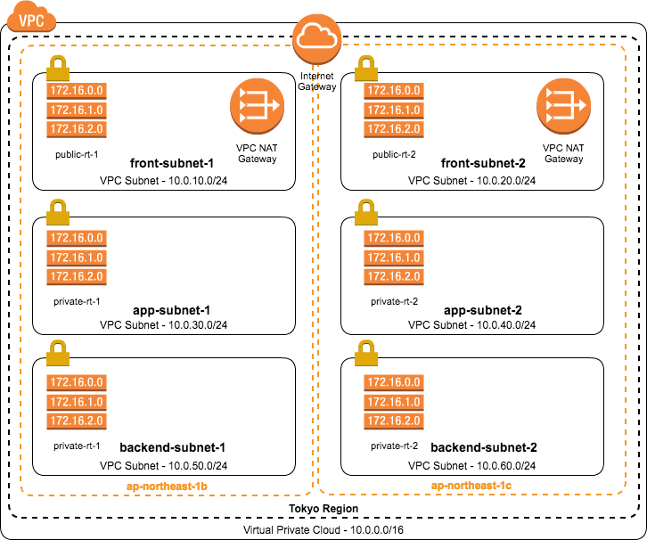
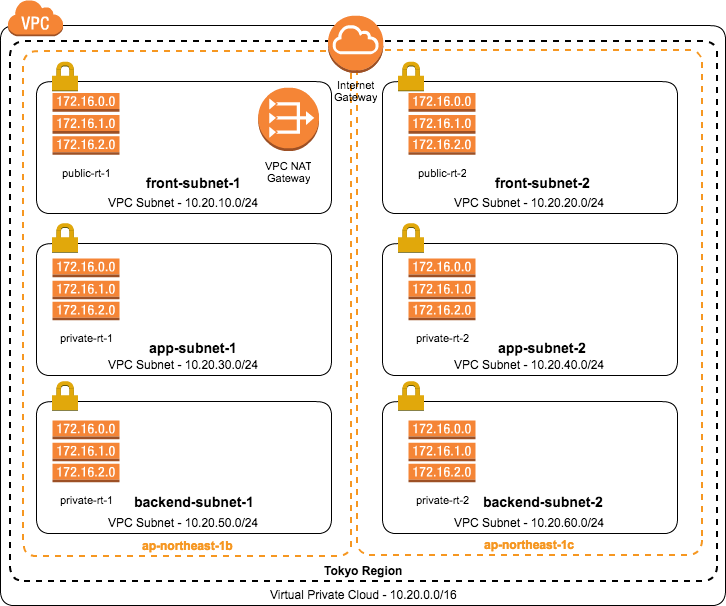

# VPC BestPractice Template For MonstarLab,Inc.
## はじめに
AWSを使用した新規プロジェクトを始める上でまずやらなければいけないことは、VPCによるネットワーク設計です。
このテンプレートはこれまでの経験を元に作られたものです。以下に簡単にこのテンプレートの説明をします。

## 説明
- 各リソースをわかりやすくネーミング
 - {project}-{vpc環境}-{リソース名}
    - demo-develop-vpc
    - demo-develop-front-subnet-1
    - demo-develop-elb-sg


- IPレンジをわかりやすいものにする
  - 第2オクテットで環境が分かるようにする
     - 10.0 => 本番
     - 10.1 => ステージング
     - 10.2 => 開発
  - 第3オクテットでサブネットが分かるようにする
     - 10,20 => front
     - 30,40 => app
     - 50,60 => backend
  - 第3オクテットでAvailabilityZoneが分かるようにする
     - 奇数 => ap-northeast-1b
     - 偶数 => ap-northeast-1c


- 3層サブネット構造（AWSのDDoS対策ホワイトペーパーでも推奨）
    - フロントサブネット（DMZ）
      - 用途：ELB、SSH bastionインスタンス、deployインスタンス
    - アプリケーションサブネット（private）
      - 用途：Web/Appインスタンス
    - バックエンドサブネット（private）
      - 用途：RDSインスタンス、ElastiCacheクラスター、Batchサーバ


- 外部連携APIなどを考慮に入れて、NATを通じてインターネット外に出て行くルーティング
    - 外部APIでは接続元のIPを制限することは少なくない
    - AutoScalingでは接続元IPは固定できない
    - privateサブネットのアプリケーションサブネットにWeb/Apサーバを配置してアウトバウンドはNATを経由するルーティングならば、提供元API業者にもNATのグローバルIPを伝えるだけでよい


- NATの冗長化
    - 本番環境では冗長化するためにそれぞれのAZに用意
    - NATにはグローバルIPを付与する（ElasticIP）
      - ElasticIPの上限はデフォルトは5つまでなので、プロジェクトでもっと必要な場合は上限申請
    - 開発環境とステージング環境ではコスト削減のためシングル


**本番環境**



**ステージング環境**


**開発環境**



## CloudFormation
### overview
VPCを作成する場合の、テンプレートを2つ用意しました。

- 本番環境用ベストプラクティステンプレート
  - vpc-bestpractice-production.template
- 開発環境・ステージング環境用ベストプラクティステンプレート
  - vpc-bestpractice.template


## Terraform
### overview
HashiCorpの[Terraform](https://www.terraform.io/)を使って各環境のVPCを作成することができます。
Terraformについては、以下の参考リンクで確認お願いします。
### 参考リンク
- [公式ページ](https://www.terraform.io/)
- [Step by stepで学ぶTerraformによる監視付きAWS構築](http://www.slideshare.net/YoTakezawa/terraform-57653858)
- [AWSでTerraformに入門](http://dev.classmethod.jp/cloud/terraform-getting-started-with-aws/)

他にもたくさん参考になりそうなページはありますので、探してみてください。

### ディレクトリ構成
```
./
├── dev
│   ├── igw.tf
│   ├── providers.tf
│   ├── rt.tf
│   ├── rta.tf
│   ├── sg.tf
│   ├── sn.tf
│   ├── terraform.tfstate
│   ├── terraform.tfstate.backup
│   ├── terraform.tfvars
│   ├── variables.tf
│   └── vpc.tf
├── prod
│   ├── igw.tf
│   ├── providers.tf
│   ├── rt.tf
│   ├── rta.tf
│   ├── sg.tf
│   ├── sn.tf
│   ├── terraform.tfstate
│   ├── terraform.tfstate.backup
│   ├── terraform.tfvars
│   ├── variables.tf
│   └── vpc.tf
├── script.sh
└── stg
    ├── igw.tf
    ├── providers.tf
    ├── rt.tf
    ├── rta.tf
    ├── sg.tf
    ├── sn.tf
    ├── terraform.tfstate
    ├── terraform.tfstate.backup
    ├── terraform.tfvars
    ├── variables.tf
    └── vpc.tf
```

### 実行方法
実行は`script.sh`を使用します。
実行時にはスクリプトの引数に以下を追加してください。

- 環境名 (dev/prod/stg)
- 実行コマンド (terraformのコマンド)
  - plan => dry-run
  - apply => リソースの作成
  - destroy => リソースの削除
- IAMのアクセスキー
- IAMのシークレットキー

### 実行コマンド例
`./script.sh dev plan AKIxxxxx oooooo`
