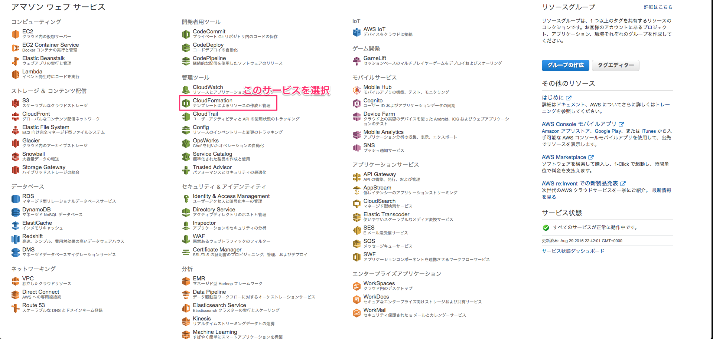
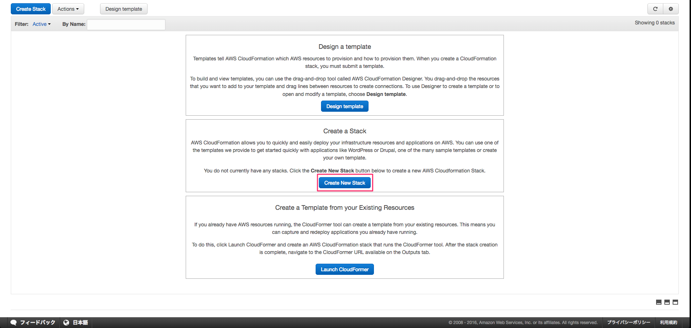
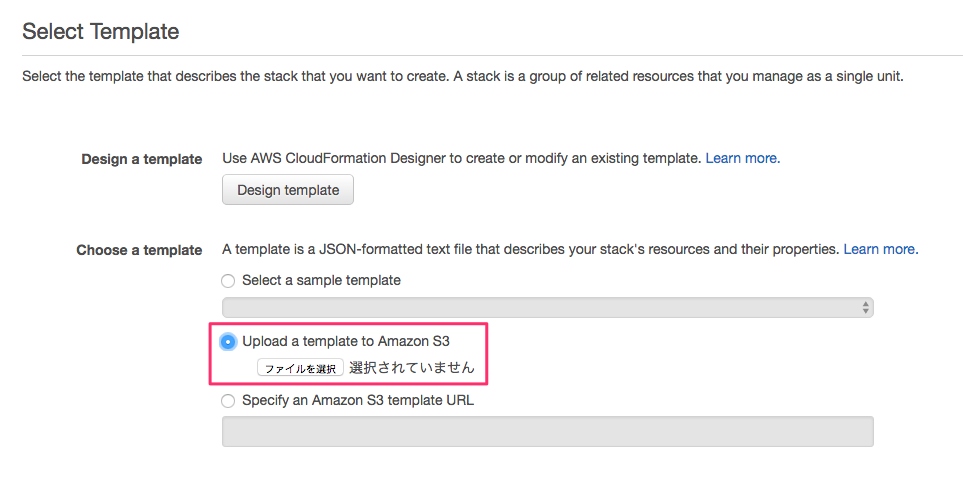
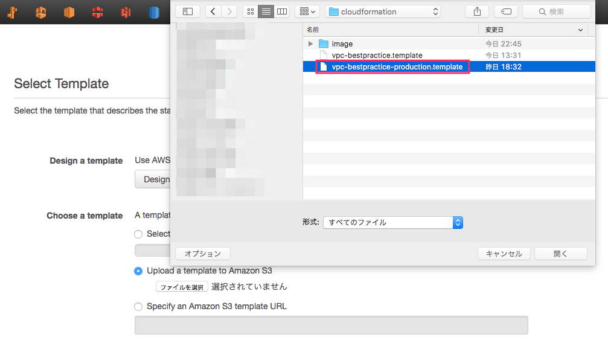
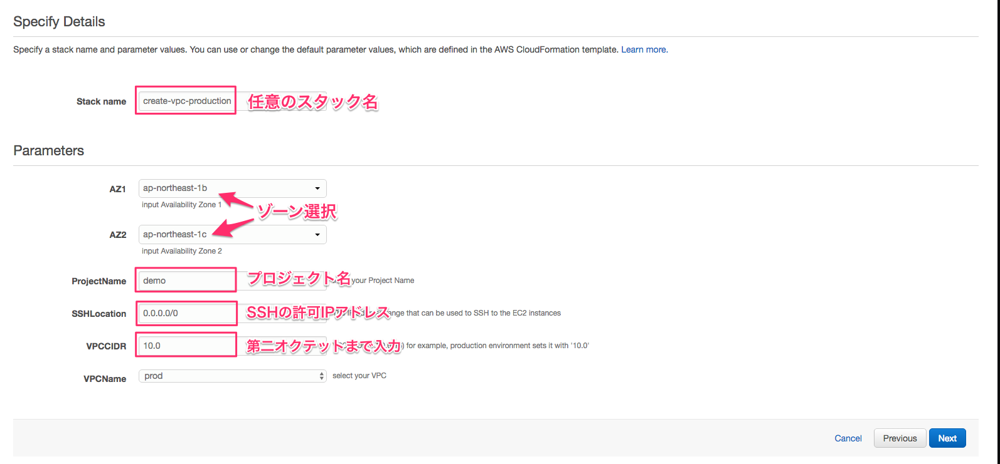
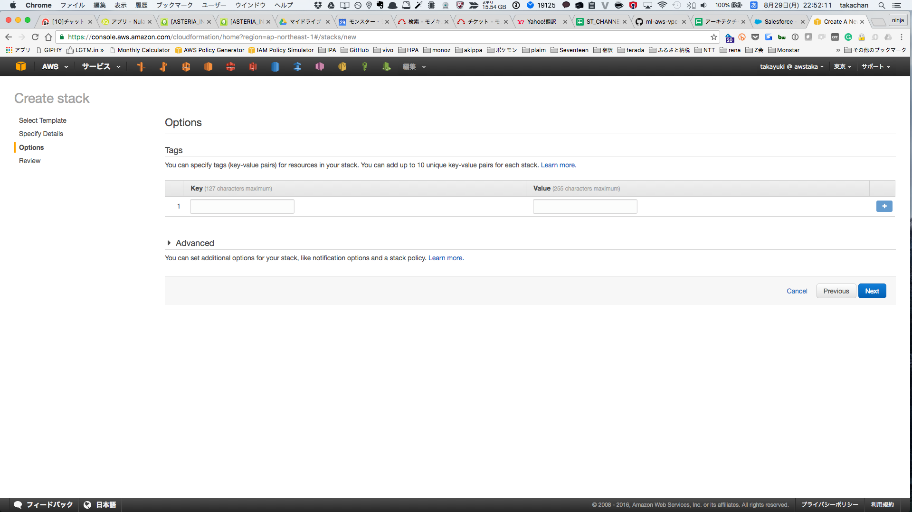
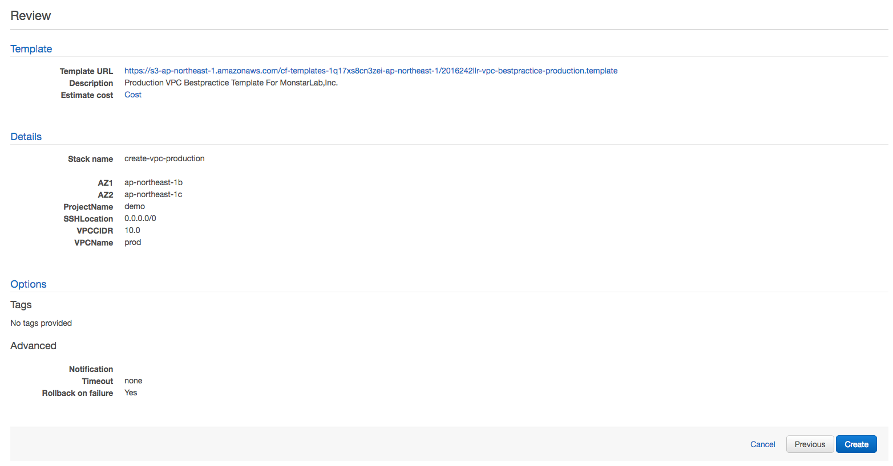
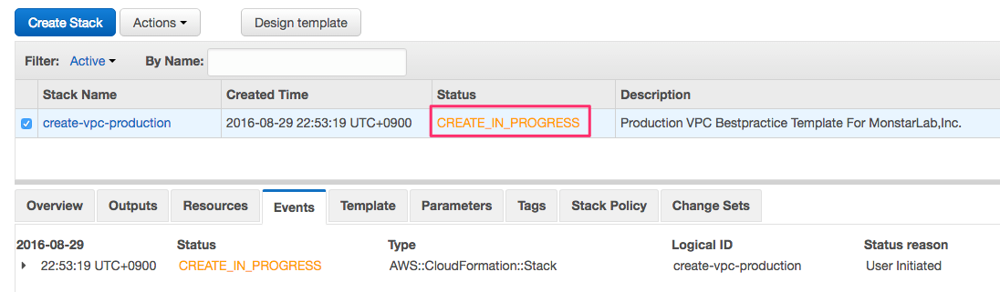
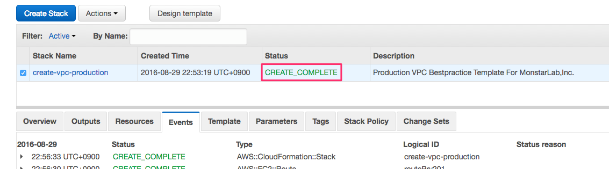

## 設定手順（本番環境）
1.AWS Management Consoleにログイン後、**[CloudFormation]** を選択する。

2.**[Create New Stack]** ボタンをクリックする。

3.テンプレートをS3にアップロードする。

4.保存しているテンプレートを選択する。

5.表示画面を参考に入力する。

6.特になければ、[Next]ボタンをクリックする。

7.内容を確認し、[Next]ボタンをクリックする。

8.スタック作成実行中画面

9.スタック作成完了画面

